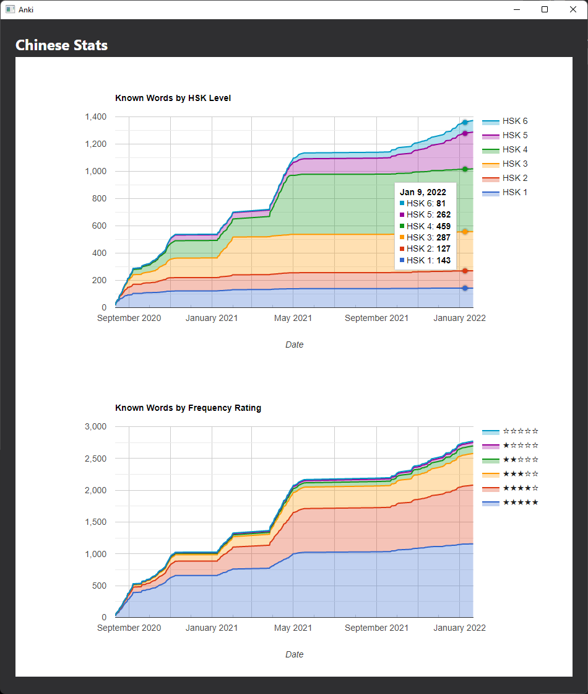
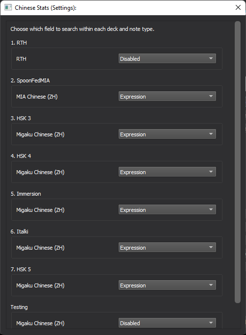

# chinese_stats
Anki Addon for Chinese Stats

## Preview

### Stats

### Settings

## Installation
Download from https://ankiweb.net/shared/info/1959794557

## Usage
With the addon installed, a menu option will appear under Tools -> Chinese Stats.

Tapping on this menu option will open an Anki window containing the stats.

## Note
The addon searches the Expression field of all notes for words from the HSK lists and frequency lists.
